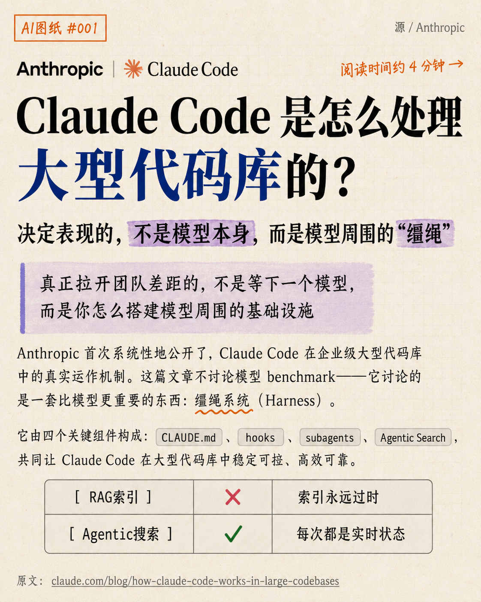
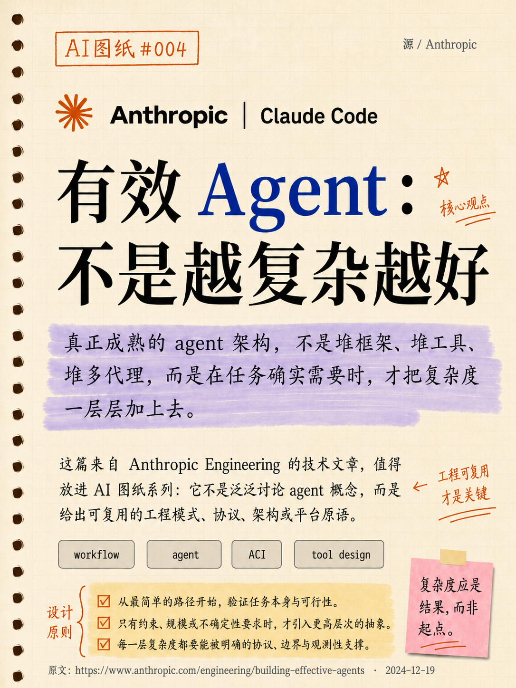

# Hand-Drawn Tech Note Skills

A reusable visual style system for turning technical ideas into hand-drawn, save-worthy engineering notes.

This is not a cute doodle style and not a generic AI poster style. The goal is to make technical analysis feel like a thoughtful page from an engineer's notebook: readable, structured, opinionated, and human.

## Examples

### AI Drawing #001

### AI Drawing #004

## What This Style Is For

- AI model release analysis
- Agent workflow breakdowns
- Engineering architecture notes
- Technical article summaries
- Developer experience retrospectives
- Personal technical judgment and builder logs

## What This Style Avoids

- Glossy 3D renders
- Generic blue-white AI posters
- Corporate SaaS landing-page visuals
- Empty slogan-only covers
- Overloaded lecture slides
- Decorative icons that compete with the text

## Files

- [`SKILL.md`](SKILL.md): the complete English style skill.
- [`assets/examples/`](assets/examples/): example cover images.

## Core Principle

Use the friendliness of hand-drawn notes to carry the density of technical writing.

